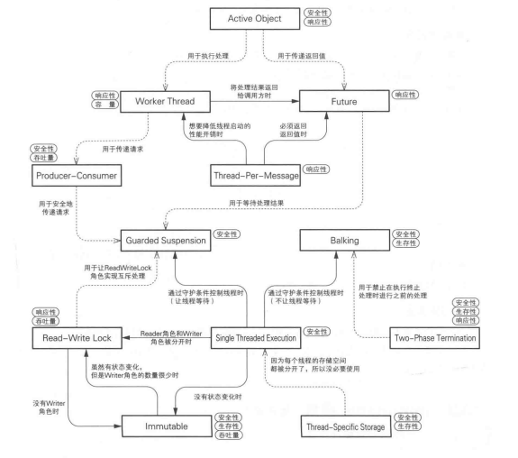

### thread-design-pattern

12种常用的多线程设计模式:


#### 1.Single Threaded Execution 

在同一时刻只允许一个线程执行，Java可以有以下几种实现方式:

* 使用synchronized关键字(single_threaded_execution.example2)
* 使用Semaphore(1)来确保被保护的代码只有一个线程在执行(single_threaded_execution.example3)

> 问题

如果多个线程同时访问同一个有状态的实例时，实例会失去安全性。

> 实现

在同一时刻只允许一个线程访问的代码(临界区)，使用Java的synchronized来保护。

> 相关模式

`Immutable:` 当实例的状态不会发生变化时，可以使用Immutable模式来提高吞吐量。

`Read-Write Lock:` 当Reader角色和Writer角色被分开时,可以使用Read-Write Lock模式来提高吞吐量。


#### 2.Immutable

Immutable是创建不可变的类来确保线程安全。

在Java中用到Imutable模式的常见类有:

* java.lang.String
* java.math.BigInteger、java.math.BigDecimal
* java.util.Pattern
* java.lang.Integer等包装类

以下的情况会破坏Immutable:

* 将字段里保存的实例直接作为getter方法的返回值(immutable.example1)
* 将构造函数的参数中传入的实例直接赋值给字段(immutable.example2)

> 问题

如果使用Single-Thread-Execution模式，吞吐量会下降。

> 实现

* 使用private来隐藏字段
* 使用final来确保字段无法改变
* 只提供getter方法，不提供setter方法


#### 3.Guarded Suspension

Guarded是‘被保护，被守卫’的意思，Suspension是‘暂停’的意思。

如果执行现在的处理会造成问题，就让执行处理的线程进行等待，直到达到了执行线程的必要条件。通过让线程等待来保证实例的安全性。

一个典型的例子就是线程通信的例子。(guarded_suspension.example1)

在Single Threaded Execution模式中，只要有一个线程进入临界区，其他线程就无法进入，只能等待。而在Guarded Suspension模式中，线程是否等待取决于守护条件。**Guarded Suspension模式是在Single Threaded Execution模式的基础上附加了条件而形成的。**

> 问题

使用Guarded Suspension模式时，可以通过守护条件来控制方法的执行。但是，如果永远无法满足守护条件，那么线程会永远等待，所以可能会失去生存性。

> 实现

在Java中，我们可以使用while语句来检查守护条件，调用wait方法来让线程等待。接着，调用notify/notifyAll方法来发送守护条件变化的通知。而检查和改变守护条件则可以使用Single-Thread-Execution模式来实现。

> 相关模式

`Balking:` 如果希望在不满足守护条件时，线程不等待，而是直接返回，可以使用Balking模式。

`Single-Threaded-Execution:` Guarded Suspension模式的检查和改变守护条件的部分可以使用Single-Thread-Execution模式。


#### 4.Balking

如果现在不适合执行这个操作，或者没必要执行这个操作，就停止处理，直接返回。

在Guarded Suspension模式中,guardedMethod的守护条件成立之前，线程会一直等待。而在Balking模式中，当守护条件不成立时，线程立即返回。

> 实现

Java可以使用if语句来检查守护条件。这里可以使用return语句从方法中返回或是通过throw语句抛出异常来进行中断。


#### 5.Producer-Consumer

生产者和消费者之间存在一定的速度差异，可以利用一个中间角色Channel来缓解速度的差异。

想从某个线程(Producer角色)向其他线程(Consumer角色)安全传递数据时。

> 实现

在Producer角色和Customer角色之间准备一个中转站-Channel角色。接着，让Channel角色持有多个数据。这样，就可以缓解Producer角色与Customer角色之间的处理速度差异。另外，如果在Channel角色中进行互斥处理，就不会失去数据的安全性。这样就可以既不降低吞吐量，又可以在多个线程之间安全地传递数据。

> 相关模式

`Guarded Suspension:` Channel角色安全传递数据地部分可以使用Guarded Suspension模式。

`Future:` 在Future模式中传递返回值的使用可以使用Producer-Consumer模式。

`Worker Thread:` 在传递请求的时候可以使用Producer-Customer模式。


#### 6.Read Write Lock

利用读取操作的线程之间不会冲突的特性来提高程序性能。

* 适合读取操作繁重时(多个线程可以同时读取提高程序性能)
* 适合读取频率比写入频率高时

synchronized是**物理锁**，每个实例都持有一个锁，但同一个锁不能由两个以上的线程同时获取，Java虚拟机也是这么实现的。

Read Write Lock是**逻辑锁**，是开发人员自己实现的一种结构，逻辑锁也是依赖于物理锁而实现的。

> 实现

将"控制Reader角色的锁"与"控制Writer角色的锁"分开，引入一个提供这两种锁的ReadWriteLock角色。ReadWriteLock角色会进行Writer角色之间的互斥处理，以及Reader角色与Writer角色之间的互斥处理。Reader角色之间即使发生冲突也不会有影响，因此无需进行互斥处理。

> 相关模式

`Guarded Suspension:` ReadWriteLock角色实现互斥处理的部分可以使用Guarded Suspension模式。

`Immutable:` 当Writer角色完全不存在时,可以使用Immutable模式。


#### 7.Thread-Per-Message

为每个命令或请求新分配一个线程，由这个线程来执行处理。

消息的‘委托端’线程会告诉‘执行端’线程，“这项工作就交给你了”。

* 适用于handle操作很耗时的操作，可以启动一个新的线程来执行这些耗时的操作，主线程返回。
* 适用于操作顺序没有要求时
* 适用于不需要返回值时(当需要获取操作结果时，可以使用Future模式)
* 服务器接收客户端的请求，将这些请求的实际处理交由其他线程执行，就是采用的这种方式

> 相关模式

`Worker Thread:` 当想要节省线程启动锁花费的时间时，可以使用Worker Thread模式。

`Future:` 当想要将处理结果返回时，可以使用Future模式。


#### 8.Worker Thread

在Worker Thread模式中，工人线程会逐个取回工作并进行处理。当所有工作全部完成后，工人线程会等待新的工作的到来。

一般在Channel类中使用线程池来缓存工人线程。相比Thread-Per-Message模式，不是每一次都创建一个新的线程，减少创建线程的消耗。

> 相关模式

`Future:` 将工人线程的处理结果返回给调用方时可以使用Future模式。

`Producer-Consumer:` 将代表请求的实例传递给工人线程时可以使用Producer-Consumer模式。


#### 9.Future

如果有一个方法需要花费很长时间才能获取运行结果。那么，与其一直等待，不如使用Future来获取结果。如果运行结果已经出来了，那么直接获取结果即可。如果运行结果还没出来，那么需要等待结果出来。

> 相关模式

`Guarded Suspension:` 在Client角色等待处理的部分可以使用Guarded Suspension模式。

`Thread-Per-Message:` 在Thread-Per-Message模式中和获取处理结果时可以使用Future模式。

`Worker Thread:` 在Worker-Thread模式中获取处理结果时可以使用Future模式。


#### 10.Two-Phase Termination

分两阶段终止。

先从"操作中"状态变为"终止处理中"状态，然后再真正地终止线程。

* 安全地终止线程(安全性):仅在线程运行至不会破坏对象安全性的位置时，程序才会开始终止处理。
* 必定会进行终止处理(生存性)：线程在收到终止请求后，会中断可以中断的wait，转入终止处理。
* 发出终止请求后尽快进行终止处理(响应性)：线程在收到终止请求后，会中断可以中断的sleep，尽快进入终止处理。在耗时的操作之前，可以检查是否收到终止请求，如果收到终止请求，在具体的操作执行前立即抛出Interrupted，可以提高程序的响应性。

> 实现

Java不仅仅要设置终止请求的标志，还要使用interrupt方法来中断wait/sleep/join方法。由于线程在wait/sleep/join中抛出InterruptedException异常时会清除中断状态,所以在使用isInterrupted方法检查终止请求是否到来时需要格外注意。当想要实现即使在运行时发生异常也能进行终止处理时，可以使用finally块。

> 相关模式

`Balking:` 当想在执行终止处理时禁止其他处理，可以使用Balking模式。


#### 11.Thread-Specific-Storage

当想让原本为单线程环境设计的对象运行于多线程环境时。

"每个线程特有的储物柜"，"为每个线程准备的存储空间","各个线程各自专用","只属于该线程"

即使是只有一个入口，也会在内部为每个线程分配特有的存储空间的模式。

ThreadLocal实现了该模式。

ThreadLocal的优势：

* 将线程独有的信息保存在"线程外"的ThreadLocal中，不改变线程结构即可实现程序
* 没有显式地执行互斥处理，编程时犯错的可能性较小


#### 12.Active-Object

Active Object模式中的主动对象会通过自己特有的线程在合适的时机处理从外部接收到的异步消息，并根据需要返回处理结果。

Active-Object有以下特征：

* 接收来自外部的异步请求
* 能够自由地调度请求
* 可以单线程执行实际的处理
* 可以返回执行结果
* 拥有独立的线程


> 相关模式

`Worker Thread:` 在实现Scheduler角色的部分可以使用Worker Thread模式。

`Producer-Consumer:` 在将请求从Proxy角色传递给Scheduler角色的部分可以使用Producer-Consumer模式。

`Future:` 在将执行结果返回给Client角色的部分可以使用Future模式。 





### 知识点

#### 1.关于synchronized方法互斥的处理:  

* 当方法没有加synchronized修饰:

  * 该方法可以在任意时间由多个线程访问。即使有线程正在访问与该方法同个类的synchronized修饰的方法。

* 如果方法有synchronized修饰:
  * 一个实例一个锁，不同实例的synchronized的方法可以同时访问。当然,同个类内的静态synchronized方法和实例的synchronized方法也可以同时访问，因为加锁的对象不同。**synchronized的静态方法加锁对象是类名.class，synchronized的实例方法加锁对象是this**
  * 同个类的静态synchronized方法不能同时访问。因为加锁的对象都是Class类的实例**xxx.class**
  
  

#### 2.Thread.sleep

* Thread.sleep方法是Thread类的静态方法，虽然通过实例调用静态方法的写法在语法上没有错，但是容易让人产生误解。(参考basic/simple/SleepDemo)
* Thread.sleep虽然提供了纳米的控制方法，但这依赖于Java的运行环境。

* Thread.sleep暂停的是当前执行的线程。


#### 3. 判断题

1. start()和run()声明在Runnable接口中。 

   ❌,start()在Thread类中，run()在Runnable中。

2. 执行sleep方法后的线程仅在指定时间内待在等待队列中。

   ❌,只有调用wait()线程才会进入等待队列。

3. wait()的调用语句必须写在synchronized方法中。

   ❌,只要执行wait()的线程在执行时获取了对象实例的锁即可，可以是synchronized方法，可以是synchronized代码块，也可以是两者调用的其他方法中。


#### 4.wait/notify/notifyAll

wait/notify/notifyAll都需要获取锁后才能调用，否则会抛出illegalMonitorStateException.(basic/simple/WaitDemo)

obj.wait(): obj实例调用wait方法后，线程会释放锁，进入obj实例的一个等待队列，当以下的任意一种情况发生时，线程会退出等待队列。

* 调用obj实例的notify/notifyAll方法时
* 有其他线程的interrupt方法来唤醒线程
* wait方法超时


obj.notify/notifyAll: obj实例调用notify/notifyAll方法后，notify/notifyAll不会释放锁，直到执行结束才会释放锁。

当notify/notifyAll释放锁后，等待队列中的线程会争夺锁继续执行。

notify只会唤醒等待队列中的一个线程。

notifyAll会唤醒等待队列中的所有线程。

notify/notifyAll唤醒等待队列中的线程是随机的，无顺序的。


Wait/notify/notifyAll是Object类的方法，不是Thread类的方法，但是Thread类也是继承自Object类，所以Thread类中也有wait/notify/notifyAll方法。与其说这三个方法是针对线程的操作，倒不如说是针对实例的等待队列的操作。


#### 5.long/double的操作不是原子性的

在操作long/double类型的，为了保证线程安全，可以有以下几个解决方法：

* 在synchronized中操作，synchronized可以保证原子性
* 在声明字段时加上volatile关键字，volatile可以保证long/double操作的原子性
* 使用JUC包的原子类进行操作


#### 6.解决死锁的思路

死锁一般是由于交叉获取临界区资源引起的，以下思路可以参考：

* 多个线程按照一定的顺序去获取资源(single_threaded_execution.example5)
* 将多个临界区的资源封装成一个对象，线程对对象加锁(single_threaded_execution.example6)
* 外界条件破坏(guarded_suspension.example3)
* 超时处理(guarded_suspension.example5)


#### 7.线程安全/非安全的Queue

LinkedList实现了Queue接口，Queue接口中定义了offer/peek的方法，但是这两个方法是非线程安全的，在使用的时候需要使用synchronized或其他方法来保证线程安全。

LinkedBlockingQueue继承了Queue接口，并提供了take/put的方法，这两个方法是线程安全的，使用时无需使用synchronized来保证线程安全。


#### 8.notify/notifyAll和interrupt的区别

notify/notifyAll 和 interrupt 方法都能唤醒wait方法。区别如下：

| notify/notifyAll                               | interrupt                                     |
| ---------------------------------------------- | --------------------------------------------- |
| Object的方法                                   | Thread的方法                                  |
| 不能指定线程唤醒                               | 可以指定线程唤醒                              |
| 执行notify/notifyAll时，线程必须要获取实例的锁 | 执行interrupt时，并不需要获取要取消的线程的锁 |


#### 9.线程中断

如果没有调用wait/join/sleep方法，或者没有编写检查线程的中断状态并抛出Interrupted异常的代码，那么Interrupted异常就不会被抛出。

* interrupt是让线程变成中断状态的方法
* interrupted是检查并清除中断状态的方法

当线程被intertupt的时候，会带来以下的结果之一：

* 线程变成"中断状态",但是不会抛出InterruptedException
* 当线程正在sleep/wait/join时,会抛出InterruptedException,但是线程不会变成'中断状态'

这两种结果是可以进行转换的：

1.中断状态转换成InterruptedException:

如果想在不清除中断状态的前提下检查当前线程的中断状态,可以使用isInterrupted方法。

```java
if(Thread.interrupted()) {
    throw new InterruptedException("interrupt");
}
```

2.InterruptedException向中断状态的转换

```java
try {
    Thread.sleep(100);
} catch (InterruptedException e) {
    Thread.currentThread().interrupt();
}
```


#### 10.性能比较

测试了使用ReadWriteLock,synchronized,ConcurrentHashMap时读取的性能比较，通过读取的次数来判读：(read_write_lock.example3~5)

性能从高到低：concurrentHashMap > readWriteLock > synchronized


#### 11.线程的异常处理

如果在线程中没有try..catch捕获异常进行处理，可以使用以下两种方式对线程的异常统一处理：

* 设置未捕获的异常处理器(two_phase_termination/example1)
* 线程退出钩子，线程退出钩子是指在Java虚拟机退出时启动的线程，使用java.lang.Runtime的addShutdownHock来设置退出钩子(two_phase_termination/example2)


